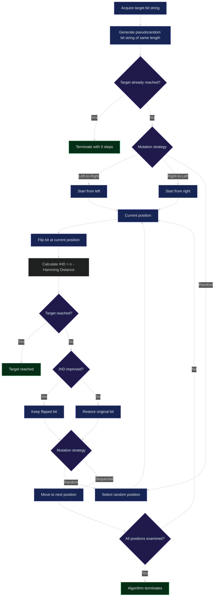

# SAHC

An implementation of the **Steepest-Ascent Hill Climbing** algorithm using bit strings.

Goal : start with a pseudorandomly generated bit string and progressively mutate it until it matches a given target.

## How to Use

### Requirements

- GCC 11 or above
- Make 4.4.1  
  - This version might be newer than necessary; slightly older versions should work fine

### Build and Run

```bash
cd <desired-dir>
git clone https://github.com/cvauthgr/SAHC
cd SAHC
make
./SAHC
```

---

## Algorithm Description

For an easier time understanding the algorithm, I took pride in creating a simple control flow visualization.

Monstrous Mermaid diagram following (you have been warned):



The algorithm first acquires the target bit string and generates a pseudorandom bit string of the same length.

The **inverse Hamming distance (IHD)** between the two bit strings is then evaluated through a simple linear comparison between the bits at each corresponding position.

For two bit strings of length `n`:

```text
IHD = n - Hamming Distance
```

In other words, the IHD represents the number of positions at which the two strings match.

Depending on whether the algorithm starts from the left or the right side of the string, it flips the bit at the current position and recalculates the IHD.

If the IHD increases, the mutation improved the candidate and the flipped bit is kept. Otherwise, the bit is restored to its original state before moving to the next position.

When using the left-to-right or right-to-left mutation strategies, the algorithm is guaranteed to reach the target after examining at most every position in the bit string.

It is also possible for the algorithm to finish in fewer steps, in a single step, or even in 0 steps if the initially generated string already matches the target.

---

## Worst-Case Scenario

Consider the following:

```text
Generated : 0000
Target    : 1111
```

As we see reaching the target would require flipping all four bits.

However, if the IHD is `0` every bit differs from the target. This means the generated bit string is the exact opposite of the target.

All bits are flipped at once using:

```cpp
.flip()
```

The target can therefore be reached in 1 step. Through this optimization, we can avoid up to ```sizeOfTarget - 1``` additional executions of the mutation function block.

This might look minuscule in hindsight, but what if we are encoding proteins in a bit string that is billions of 0s and 1s long? As the size scales, even one unnecessary cycle can become increasingly expensive.

---

## Mutation Strategies

The program currently supports three different ways of selecting bits for mutation:

- Left-to-right mutation
- Right-to-left mutation
- Random bit mutation

The first two examine each position in a fixed order.

Random mutation chooses a new index every time, meaning previously flipped positions can and will be selected again.

---

## Examples

The examples here match the program output.

### Left-to-Right Mutation

```text
Target : 1010
Pseudorandomly generated initial bit string : 0000
Found a better bit string -> 1000 | Step : 1
Found a better bit string -> 1010 | Step : 3
Target reached : 1010 == 1010
Steps to goal : 3
```

### Right-to-Left Mutation

```text
Target : 1010
Pseudorandomly generated initial bit string : 0110
Found a better bit string -> 0010 | Step : 3
Found a better bit string -> 1010 | Step : 4
Target reached : 1010 == 1010
Steps to goal : 4
```

### Random Bit Mutation

The index is selected randomly during every mutation. Previously flipped bits **can be flipped again**.

```text
Target : 1010
Pseudorandomly generated initial bit string : 0000
Found a better bit string -> 0010 | Step : 3
Found a better bit string -> 1010 | Step : 5
Target reached : 1010 == 1010
Steps to goal : 5
```
